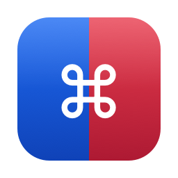
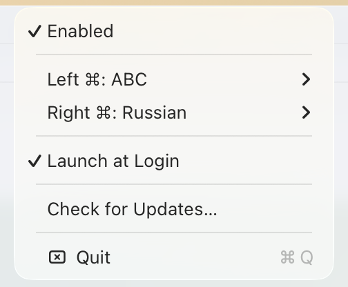

# 2cmd

[](https://github.com/tonatoz/2cmd/actions/workflows/ci.yml)
[](https://github.com/tonatoz/2cmd/releases/latest)
[](LICENSE)

A tiny macOS menu bar utility: tap the **left ⌘** to switch to one keyboard layout,
tap the **right ⌘** to switch to another. Both layouts are configurable, and the
interception can be turned off from the menu.

Tapping means pressing and releasing ⌘ with nothing in between. ⌘C, ⌘Tab, ⌘-click,
⌥⌘ and friends keep working exactly as before: every event is passed through
unchanged, nothing is modified or swallowed.



## Requirements

- macOS 15 or newer, Apple silicon or Intel
- Both layouts you want to use must already be enabled in
  System Settings → Keyboard → Input Sources
- Building from source needs the Swift toolchain from the Command Line Tools;
  full Xcode is not required

## Install

Download `2cmd.dmg` or `2cmd.zip` from the
[latest release](https://github.com/tonatoz/2cmd/releases/latest), move the app into
`/Applications` and launch it. macOS will report that the developer cannot be verified,
because the app is signed with a local certificate and not notarized — open it once via
**System Settings → Privacy & Security → Open Anyway**, or clear the quarantine flag:

```sh
xattr -dr com.apple.quarantine /Applications/2cmd.app
```

Then grant Accessibility, as described below.

## Build and install

```sh
make signing-cert   # once, see "Making the grant survive rebuilds"
make install        # build, sign, copy to /Applications
open /Applications/2cmd.app
```

Other targets:

```sh
make app          # build dist/2cmd.app only
make run          # build and launch from dist/
make test         # run the state machine checks
make icon         # regenerate dist/AppIcon.icns
make release      # universal bundle + dist/2cmd.zip for another Mac
make uninstall    # remove /Applications/2cmd.app
make clean
```

Installing into `/Applications` is recommended: both the Accessibility permission and
launch-at-login are tied to the app's location and signature.

## Moving the app to another Mac

`make install` builds for the current architecture only. For another machine build a
universal bundle and archive it — `ditto` is used rather than `zip` because it keeps
the signature and bundle structure intact:

```sh
make release      # -> dist/2cmd.zip, x86_64 + arm64, ~500 KB
```

On the other Mac:

```sh
ditto -x -k 2cmd.zip /Applications
xattr -dr com.apple.quarantine /Applications/2cmd.app   # only if it was downloaded
open /Applications/2cmd.app
```

Then grant Accessibility there as well — TCC decisions are per machine.

Two things to expect:

- **Gatekeeper rejects the app** (`spctl --assess` → `rejected`), because it is signed
  with a local certificate and not notarized. That only matters if the copy carries the
  quarantine flag, which is attached by browsers, AirDrop and messengers — not by
  `scp`, `rsync` or a USB stick. Either strip it with the `xattr` line above, or open
  the app once via **System Settings → Privacy & Security → Open Anyway**.
- **macOS 15 or newer is required** (`LSMinimumSystemVersion`), and the signing
  certificate's private key stays on this machine — the other Mac does not need it,
  the certificate itself travels inside the signature.

If the other machine is also a development machine, the cleaner route is to copy the
repository and run `make signing-cert && make install` there: it gets its own local
identity and no quarantine is ever involved.

For handing the app to someone else properly, the only real fix for the Gatekeeper
warning is a paid Developer ID certificate plus notarization (`xcrun notarytool`).

## Granting permission

An event tap requires the Accessibility permission. On first launch macOS shows a
prompt; open **System Settings → Privacy & Security → Accessibility** and enable
**2cmd**. No restart needed — the app polls for the grant and starts working as soon
as it appears. While the permission is missing (or interception is off) the menu bar
icon stays dimmed.

### The stale-grant trap (important)

TCC stores the grant together with a *code signing requirement*. With an ad-hoc
signature there is no certificate, so that requirement collapses to the exact
`cdhash` of one build. Rebuild the app and the identity changes, so:

- the checkbox in Accessibility **stays switched on while access is actually denied**;
- `AXIsProcessTrustedWithOptions(prompt:)` **shows no prompt**, because macOS already
  has a decision on file for that identifier;
- **switching the checkbox off and on does not help** — that rewrites only the allow
  bit, not the stored requirement.

What actually works, either one:

```sh
make reset-permission     # tccutil reset Accessibility dev.anton.2cmd, then relaunch
```

or remove 2cmd from the Accessibility list with the **−** button and add it again.

### Making the grant survive rebuilds

Sign every build with a stable certificate instead. A self-signed one is enough — no
paid Developer ID required — because TCC only needs the identity to stay constant:

```sh
make signing-cert     # once
make install
```

That creates a local `2cmd Local Signing` code-signing certificate, imports it into
the login keychain (pre-authorised for `codesign`, so no password prompts) and from
then on `make install` prints `Signing with stable identity`. `security find-identity`
lists it as `CSSMERR_TP_NOT_TRUSTED` — expected and harmless: the certificate has no
trusted anchor, and TCC only needs a stable identity, not a trusted one. The
certificate cannot be used to distribute the app.

The effect is visible in the requirement stored with the grant:

```
# ad-hoc     — changes on every rebuild
designated => cdhash H"0fa1c9…"
# certificate — stays put
designated => identifier "dev.anton.2cmd" and certificate leaf = H"e79f95…"
```

Override the name with `make install SIGN_IDENTITY="My Cert"`. Without a certificate
the build still works, but prints a warning and the permission dies on every rebuild.

### Why `.defaultTap`

Since macOS 10.15 a *listen-only* keyboard tap is gated by the separate **Input
Monitoring** service, while `.defaultTap` is covered by Accessibility. The app uses
`.defaultTap` and returns every event unchanged, so it needs one permission, not two.

## Menu

- **Enabled** — turn interception on or off
- **Left ⌘ / Right ⌘** — pick the layout for each key
- **Launch at Login** — register as a login item (`SMAppService`)
- **Check for Updates…** — compares the running version against the latest release
- **Quit**

Defaults on first launch: left ⌘ → your English layout, right ⌘ → your Russian
layout, chosen from the input sources already enabled in the system.

## Privacy

The app needs the Accessibility permission to install a `CGEventTap`, which is the
same mechanism a keylogger would use. What it actually does with it:

- **Keystrokes are never stored, logged or transmitted.** The tap callback looks at one
  modifier key code and the modifier flags, then returns the event unchanged. Nothing
  is buffered.
- **Only modifier changes matter.** `keyDown` and `keyUp` are observed solely to cancel
  a pending gesture; their key codes are never read.
- **No network access at all**, except when you explicitly choose
  *Check for Updates…*, which requests one public GitHub API URL and sends no data
  about you.
- **No analytics, no telemetry, no crash reporting.** Settings live in `UserDefaults`
  and hold two input source identifiers and one boolean.
- Diagnostics go to the unified log and contain no keystrokes:

  ```sh
  log show --last 5m --predicate 'subsystem == "dev.anton.2cmd"' --info
  ```

The whole event path is `Sources/TwoCmd/KeyTapMonitor.swift` plus
`Sources/TwoCmdCore/SoloTapDetector.swift` — about 200 lines, worth reading if you are
about to grant Accessibility to a stranger's binary.

## How it works

| File | Role |
| --- | --- |
| `Sources/TwoCmdCore/SoloTapDetector.swift` | Gesture state machine, no AppKit, covered by checks |
| `Sources/TwoCmdCore/ActivationCoordinator.swift` | Permission/tap startup, retries until the tap is up |
| `Sources/TwoCmdCore/Version.swift` | Numeric version comparison for the update check |
| `Sources/TwoCmd/KeyTapMonitor.swift` | `CGEventTap` on `flagsChanged` plus mouse monitors |
| `Sources/TwoCmd/InputSourceManager.swift` | Text Input Source Services wrapper |
| `Sources/TwoCmd/StatusItemController.swift` | Menu bar item and menu |
| `Sources/TwoCmd/UpdateChecker.swift` | Latest release lookup via the GitHub API |
| `Sources/TwoCmd/Settings.swift` | `UserDefaults` persistence |
| `Sources/TwoCmd/AppDelegate.swift` | Permission flow and wiring |
| `Tools/MakeIcon.swift` | Draws the app icon (see below) |
| `Tools/make-signing-cert.sh` | Creates the local signing identity |

### Icon

The app icon is generated from source — AppKit draws it, `iconutil` packs the
`.icns`, so no binary artwork is committed:

```sh
make icon    # dist/AppIcon.icns, rebuilt when Tools/MakeIcon.swift changes
```

A white ⌘ on a canvas split left/right — blue for the left ⌘, red for the right ⌘.
Nothing else, so it stays readable down to 16 px.

The menu bar icon is deliberately different: an SF Symbol drawn as a template image,
so it stays monochrome and follows the system appearance, per the macOS HIG.

The detector keys off *device-dependent* modifier bits (`NX_DEVICELCMDKEYMASK` and
friends) rather than `maskCommand`, so the left and right ⌘ can be told apart, and a
release only counts when no other modifier is still held. Caps lock is ignored for
that check since it is a latched state rather than a held key.

Mouse and scroll events are observed through `NSEvent` monitors instead of the event
tap, because including mouse events in a `CGEventTap` is known to interfere with
dragging.
