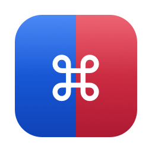
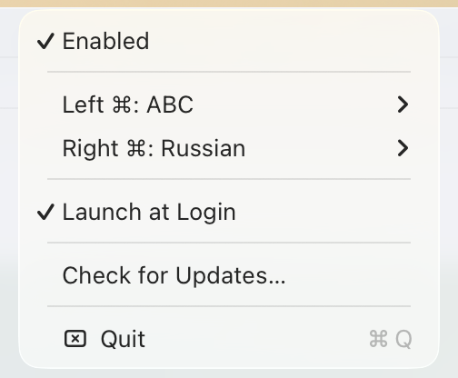

# 2cmd

[](https://github.com/tonatoz/2cmd/actions/workflows/ci.yml)
[](https://github.com/tonatoz/2cmd/releases/latest)
[](LICENSE)

A small macOS menu bar utility. By default, tap the **left ⌘** to select one keyboard
layout and the **right ⌘** to select another. Pick either layout directly in the menu.
Users who need only these two keys do not need additional setup.

**Configure Keys…** lets you replace the default keys and create up to five bindings.
A solo modifier tap means pressing and releasing it without other keyboard or mouse
activity. Shortcuts such as ⌘C, ⌘Tab, and ⌘-click keep their normal behavior.
An assigned ordinary key switches on key down and suppresses its normal action.



## Requirements

- macOS 15 or newer, Apple silicon or Intel
- The input sources you want to use must already be enabled in
  System Settings → Keyboard → Input Sources
- Building from source needs the Swift toolchain from the Command Line Tools;
  full Xcode is not required

## Install

Install with Homebrew:

```sh
brew trust --cask tonatoz/tap/2cmd     # Homebrew 6 ignores untrusted third-party taps
brew install --cask tonatoz/tap/2cmd
```

Homebrew installs the app into `/Applications` and follows new GitHub releases.
Alternatively, download `2cmd.dmg` or `2cmd.zip` from the
[latest release](https://github.com/tonatoz/2cmd/releases/latest) and move the app
into `/Applications`.

The app is signed with this project's own certificate and is not notarized, and
Homebrew quarantines every download — unconditionally, since `--no-quarantine` and
its `HOMEBREW_CASK_OPTS` equivalent were removed from Homebrew in July 2026. A
quarantined build of this kind is spawned by launchd and then held by Gatekeeper
before its `main()` runs, so the failure does not look like a security prompt at all:
the process is listed in Activity Monitor, no menu bar icon ever appears, and the
only hint is a "2cmd was not opened" alert that is easy to miss. The cask therefore
drops the quarantine flag in a `postflight_steps` block; nothing else is needed.

For a `.dmg` or `.zip` download the flag has to be cleared by hand:

```sh
xattr -dr com.apple.quarantine /Applications/2cmd.app
open /Applications/2cmd.app
```

Approving the app once in **System Settings → Privacy & Security → Open Anyway**
works too. Then grant Accessibility, as described below.

Releases are signed with a dedicated certificate that stays the same across versions,
so the Accessibility permission survives updates. You can check that a download really
came from this project's release pipeline:

```sh
codesign -d -r- /Applications/2cmd.app | grep designated
# designated => identifier "dev.anton.2cmd" and certificate leaf = H"33dbe410cf5122fca09f92e2bb49b888e797c508"
```

## Build and install

```sh
make signing-cert   # once, see "Making the grant survive rebuilds"
make install        # build, sign, copy to /Applications
open /Applications/2cmd.app
```

Other targets:

```sh
make app          # build dist/2cmd.app only
make run          # build and launch from dist/
make test         # run the state machine checks
make icon         # regenerate dist/AppIcon.icns
make release      # universal bundle + dist/2cmd.zip for another Mac
make uninstall    # remove /Applications/2cmd.app
make clean
```

Installing into `/Applications` is recommended: both the Accessibility permission and
launch-at-login are tied to the app's location and signature.

## Moving the app to another Mac

`make install` builds for the current architecture only. For another machine build a
universal bundle and archive it — `ditto` is used rather than `zip` because it keeps
the signature and bundle structure intact:

```sh
make release      # -> dist/2cmd.zip, x86_64 + arm64, ~500 KB
```

On the other Mac:

```sh
ditto -x -k 2cmd.zip /Applications
xattr -dr com.apple.quarantine /Applications/2cmd.app   # only if it was downloaded
open /Applications/2cmd.app
```

Then grant Accessibility there as well — TCC decisions are per machine.

Two things to expect:

- **Gatekeeper rejects the app** (`spctl --assess` → `rejected`), because it is signed
  with a local certificate and not notarized. That only matters if the copy carries the
  quarantine flag, which is attached by browsers, AirDrop and messengers — not by
  `scp`, `rsync` or a USB stick. Either strip it with the `xattr` line above, or open
  the app once via **System Settings → Privacy & Security → Open Anyway**.
- **macOS 15 or newer is required** (`LSMinimumSystemVersion`), and the signing
  certificate's private key stays on this machine — the other Mac does not need it,
  the certificate itself travels inside the signature.

If the other machine is also a development machine, the cleaner route is to copy the
repository and run `make signing-cert && make install` there: it gets its own local
identity and no quarantine is ever involved.

For handing the app to someone else properly, the only real fix for the Gatekeeper
warning is a paid Developer ID certificate plus notarization (`xcrun notarytool`).

## Granting permission

An event tap requires the Accessibility permission. On first launch macOS shows a
prompt; open **System Settings → Privacy & Security → Accessibility** and enable
**2cmd**. No restart needed — the app polls for the grant and starts working as soon
as it appears. While the permission is missing (or interception is off) the menu bar
icon stays dimmed.

### The stale-grant trap (important)

TCC stores the grant together with a *code signing requirement*. With an ad-hoc
signature there is no certificate, so that requirement collapses to the exact
`cdhash` of one build. Rebuild the app and the identity changes, so:

- the checkbox in Accessibility **stays switched on while access is actually denied**;
- `AXIsProcessTrustedWithOptions(prompt:)` **shows no prompt**, because macOS already
  has a decision on file for that identifier;
- **switching the checkbox off and on does not help** — that rewrites only the allow
  bit, not the stored requirement.

What actually works, either one:

```sh
make reset-permission     # tccutil reset Accessibility dev.anton.2cmd, then relaunch
```

or remove 2cmd from the Accessibility list with the **−** button and add it again.

### Making the grant survive rebuilds

Sign every build with a stable certificate instead. A self-signed one is enough — no
paid Developer ID required — because TCC only needs the identity to stay constant:

```sh
make signing-cert     # once
make install
```

That creates a local `2cmd Local Signing` code-signing certificate, imports it into
the login keychain (pre-authorised for `codesign`, so no password prompts) and from
then on `make install` prints `Signing with stable identity`. `security find-identity`
lists it as `CSSMERR_TP_NOT_TRUSTED` — expected and harmless: the certificate has no
trusted anchor, and TCC only needs a stable identity, not a trusted one. The
certificate cannot be used to distribute the app.

The effect is visible in the requirement stored with the grant:

```
# ad-hoc     — changes on every rebuild
designated => cdhash H"0fa1c9…"
# certificate — stays put
designated => identifier "dev.anton.2cmd" and certificate leaf = H"e79f95…"
```

Override the name with `make install SIGN_IDENTITY="My Cert"`. Without a certificate
the build still works, but prints a warning and the permission dies on every rebuild.

### Why `.defaultTap`

Since macOS 10.15 a *listen-only* keyboard tap is gated by the separate **Input
Monitoring** service, while `.defaultTap` is covered by Accessibility. The app uses
`.defaultTap`, which needs Accessibility. It suppresses only assigned ordinary presses
and presses captured by key recording. Other events pass through unchanged.

## Troubleshooting

### The process is running, but there is no menu bar icon

Gatekeeper is holding the app before it starts. A quarantined, non-notarized build is
spawned by launchd and then stopped inside dyld, so `ps` and Activity Monitor list a
live process that never created its status item. Confirm it:

```sh
xattr -p com.apple.quarantine /Applications/2cmd.app     # flag still there?
sample $(pgrep -x 2cmd) 1 | grep -c TwoCmd_main          # 0 = never reached main()
log show --last 5m --predicate 'process == "amfid"' | grep 2cmd
# ... not valid: Error Code=-423 "The file is adhoc signed or signed by an unknown
#     certificate chain"
```

Fix: clear the quarantine flag (see [Install](#install)) and reopen the app. A healthy
process shows `TwoCmd_main → -[NSApplication run]` in `sample`.

### The layout changes when I switch apps with ⌘⇥

That is macOS, not 2cmd: **System Settings → Keyboard → "Automatically switch to a
document's input source"** remembers an input source per app and restores it on
activation. Check and disable:

```sh
defaults read com.apple.HIToolbox AppleGlobalTextInputProperties
# { TextInputGlobalPropertyPerContextInput = 1; }   ← 1 means the feature is on
```

2cmd cannot fire on ⌘⇥: the ⇥ `keyDown` reaches the tap and voids the pending gesture
before ⌘ is released. To see what the app itself does, watch its log:

```sh
log stream --level info --predicate 'subsystem == "dev.anton.2cmd"'
```

A completed binding logs `select <input source id> -> true` when selection succeeds.

## Menu

- **Enabled** — turn interception on or off
- **Configured keys** — pick the input source for each key; initially Left ⌘ and Right ⌘
- **Configure Keys…** — edit physical keys and add optional bindings
- **Launch at Login** — register as a login item (`SMAppService`)
- **Check for Updates…** — compares the running version against the latest release
- **Quit**

Defaults on first launch: left ⌘ → your English layout, right ⌘ → your Russian
layout, chosen from the input sources already enabled in the system.

### Configure keys

The configuration window starts with two required rows. Change their keys or input
sources, or add up to three optional rows. Only optional rows can be deleted.

1. Choose **Configure Keys…** from the menu.
2. Choose an input source for each row.
3. Choose **Record Key**, then press the physical key you want to assign.
4. Choose **Apply** to activate and save the complete configuration.

**Cancel** or closing the window discards unapplied edits. Existing bindings remain
active while you edit. Recording temporarily suspends switching and consumes the
captured press. Use **Cancel Recording** to cancel without reserving Escape.

Supported assignments include:

- Left and right Command, Option, and Control
- Character keys
- Ordinary function keys
- Navigation keys
- Editing keys

Fn/Globe, Caps Lock, Shift, and multimedia keys cannot be assigned. Standard
function-key events must reach macOS as function keys, rather than their multimedia actions.

A physical key code identifies each binding, independently of the active input source.
Letter labels describe their US keyboard positions. A key cannot appear in two rows,
but different keys can select the same input source.

An assigned ordinary key loses its normal action while its input source is available.
The window shows this warning before you apply. Holding the key does not switch again.
Shortcuts pass through when the modifier precedes the assigned key. Pressing an
assigned letter before Command does not reconstruct an already-suppressed shortcut.

**Restore Standard Keys** restores left and right Command in the draft, retains the
first two rows' input sources, and removes optional rows. Choose **Apply** to confirm
that draft, or **Cancel** to retain the previous configuration.

If an input source becomes unavailable, the app retains its binding and marks it.
The key temporarily performs its normal action. The binding resumes when that input
source becomes available again.

Settings survive app restarts and updates. Existing left/right selections migrate
automatically. Menu source selection saves immediately; it is unavailable while the
configuration window is open, so it cannot overwrite a draft.


## Privacy

The app needs the Accessibility permission to install a `CGEventTap`, which is the
same mechanism a keylogger would use. What it actually does with it:

- **Typed text is never stored, logged, or transmitted.** The event path reads physical
  key codes, modifier flags, and repeat status. It retains only transient press state
  to recognize gestures and pair intercepted releases.
- **Only configured presses switch input sources.** Ordinary assigned keys are
  suppressed when used without a held modifier. Unassigned keys pass through.
- **No network access at all**, except when you explicitly choose
  *Check for Updates…*, which requests one public GitHub API URL and sends no data
  about you.
- **No analytics, telemetry, or crash reporting.** Settings live in `UserDefaults`
  and contain up to five key-code/source-ID pairs plus the Enabled preference.
- Diagnostics go to the unified log and contain no keystrokes:

  ```sh
  log show --last 5m --predicate 'subsystem == "dev.anton.2cmd"' --info
  ```

The event path is `Sources/TwoCmd/KeyTapMonitor.swift` plus
`Sources/TwoCmdCore/KeyBindingDetector.swift`. Read it before granting Accessibility
to a binary you do not trust.

## How it works

| File | Role |
| --- | --- |
| `Sources/TwoCmdCore/KeyBinding.swift` | Physical keys, binding model, and configuration validation |
| `Sources/TwoCmdCore/KeyBindingDetector.swift` | Gesture recognition and ordinary-key event decisions, no AppKit |
| `Sources/TwoCmdCore/ActivationCoordinator.swift` | Permission/tap startup, retries until the tap is up |
| `Sources/TwoCmdCore/Version.swift` | Numeric version comparison for the update check |
| `Sources/TwoCmd/KeyTapMonitor.swift` | Keyboard event tap, press suppression, and mouse monitors |
| `Sources/TwoCmd/InputSourceManager.swift` | Text Input Source Services wrapper |
| `Sources/TwoCmd/StatusItemController.swift` | Menu bar item and menu |
| `Sources/TwoCmd/BindingConfigurationController.swift` | Native configuration window and draft editing |
| `Sources/TwoCmd/UpdateChecker.swift` | Latest release lookup via the GitHub API |
| `Sources/TwoCmd/Settings.swift` | `UserDefaults` persistence |
| `Sources/TwoCmd/AppDelegate.swift` | Permission flow and wiring |
| `Tools/MakeIcon.swift` | Draws the app icon (see below) |
| `Tools/make-signing-cert.sh` | Creates the local signing identity |

### Icon

The app icon is generated from source — AppKit draws it, `iconutil` packs the
`.icns`, so no binary artwork is committed:

```sh
make icon    # dist/AppIcon.icns, rebuilt when Tools/MakeIcon.swift changes
```

A white ⌘ on a canvas split left/right — blue for the left ⌘, red for the right ⌘.
Nothing else, so it stays readable down to 16 px.

The menu bar icon is deliberately different: an SF Symbol drawn as a template image,
so it stays monochrome and follows the system appearance, per the macOS HIG.

The detector keys off *device-dependent* modifier bits (`NX_DEVICELCMDKEYMASK` and
friends) rather than `maskCommand`, so the left and right ⌘ can be told apart, and a
release only counts when no other modifier is still held. Caps lock is ignored for
that check since it is a latched state rather than a held key.

Mouse and scroll events are observed through `NSEvent` monitors instead of the event
tap, because including mouse events in a `CGEventTap` is known to interfere with
dragging.
